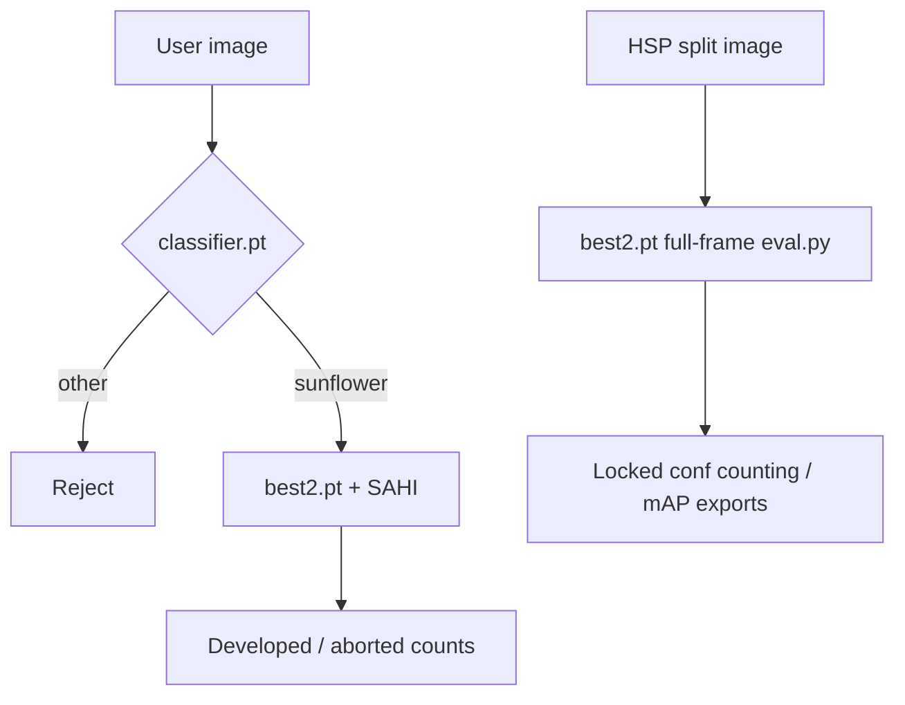

# HSP baseline weights (`models/best2.pt`, `models/classifier.pt`)

Frozen production weights used for **deploy** (Telegram / one-shot SAHI) and as the **HSP manuscript baseline** for `sunflower-cvat-2500` eval (`scripts/eval.py`). Class semantics in the repo are always **id 0 = developed**, **id 1 = aborted** (`harchoc/sunflower_dataset.py`, `data/README.md`).

| Doc | Role |
|-----|------|
| [backlog.md](../backlog.md) | Open tasks — [§ Work queue](../backlog.md#work-queue-p0--p2) |
| [EXPERIMENTS.md](EXPERIMENTS.md) | HSP export / sweep / dual-metric commands |
| [reports/hsp/p0_summary.md](../reports/hsp/p0_summary.md) | Locked metrics (MAE, ECE, deploy vs manuscript) |
| [RESEARCH_AND_OPS.md](RESEARCH_AND_OPS.md) | Ops layers + literature map |

Manifest checksums: [`reports/hsp/baseline_models_manifest.json`](../reports/hsp/baseline_models_manifest.json). Short pointer: [`reports/hsp/baseline_models.md`](../reports/hsp/baseline_models.md). HSP eval spec: [`configs/experiments/eval_hsp_baseline.json`](../configs/experiments/eval_hsp_baseline.json). **Default path constant:** `harchoc.hsp_weights.HSP_DETECTION_WEIGHTS` (`models/best2.pt`; override via `DETECTION_MODEL`). Deploy vs manuscript parity: backlog **R-SCI-2** (Done).

```bash
python scripts/experiment.py deploy-parity --dry-run
python scripts/experiment.py deploy-parity --locked-conf-from reports/hsp/threshold_val.json \
  --out reports/hsp/deploy_hsp_parity.json
python scripts/experiment.py deploy-parity --locked-conf-from reports/hsp/threshold_val.json \
  --sample-images 5 --split-file data/splits/test.txt --weights models/best2.pt
```

`run_infer_once.py` optional `--fullframe-export` runs full-frame `eval_export` at locked conf on one image (debug; not SAHI).

---

## Role split: detection vs classification

| Weight | Task (Ultralytics) | Role | Used by |
|--------|-------------------|------|---------|
| `models/best2.pt` | `detect` (2 classes) | **Seed detection + counting** on a sunflower head (developed vs aborted boxes) | `telegram_bot.py`, `run_infer_once.py`, `tune_sahi_params.py`, `scripts/eval.py`, `scripts/pipeline_request.py` (metadata) |
| `models/classifier.pt` | `classify` (2 classes) | **Image gate**: accept only “sunflower” vs reject “other” before running detection | `telegram_bot.py` only (not HSP eval / not `eval.py`) |

**Detection model class names in the checkpoint** (Ultralytics `names`): `0: fertilized_seed`, `1: unfertilized_seed`. These align with repo labels **developed** (0) and **aborted** (1). Deploy UI strings use “Fertilized” / “Unfertilized” (`telegram_bot.py` `CLASSES`); counts map to developed/aborted in `pipeline_request.v1` JSON.

**Classifier classes:** `0: other`, `1: sunflower`. Default accept rule: top-1 class `1` with confidence ≥ `0.5` (`is_sunflower_image`). Set `SKIP_CLASSIFIER=true` to skip (~20s saved on CPU).

---

## Environment variables

| Variable | Default | Consumed by |
|----------|---------|-------------|
| `DETECTION_MODEL` | `models/best2.pt` | `run_infer_once.py`, `scripts/eval.py` (`--weights` override wins), `scripts/pipeline_request.py` |
| `CLASSIFIER_MODEL` | `models/classifier.pt` | `scripts/pipeline_request.py` (contract only); `telegram_bot.py` uses hardcoded `CLASSIFIER_PATH` unless you symlink or patch |
| `FORCE_DEVICE` | auto (`cuda` if available) | Bot, `run_infer_once.py` |
| `SKIP_CLASSIFIER` | `false` | `telegram_bot.py` |

`telegram_bot.py` does **not** read `DETECTION_MODEL` / `CLASSIFIER_MODEL` today; it hardcodes `models/best2.pt` and `models/classifier.pt`. For parity with eval, set paths via env only on `run_infer_once.py` / `eval.py`, or align bot paths in a future change.

---

## Deploy path (SAHI + post-filter)

**Entrypoints:** `telegram_bot.py`, `run_infer_once.py` (same thresholds; bot adds classifier + Telegram I/O).

**Inference stack:** SAHI sliced prediction on `best2.pt` via `AutoDetectionModel` (`model_type=ultralytics`), then shared post-filter [`harchoc/deploy_filters.py`](../harchoc/deploy_filters.py) (`filter_object_predictions` + `DeployFilterConfig`).

| Parameter | Default | Env override |
|-----------|---------|--------------|
| Slice size | 500 | `SLICE_SIZE` |
| Slice overlap | 0.35 | `OVERLAP` |
| Model forward conf (min of per-class) | `min(0.06, 0.04) = 0.04` | `CONF_THR_FERTILIZED`, `CONF_THR_UNFERTILIZED`, legacy `CONF_THR` |
| Post-filter conf (class 0 developed) | 0.06 | `CONF_THR_FERTILIZED` |
| Post-filter conf (class 1 aborted) | 0.04 | `CONF_THR_UNFERTILIZED` |
| SAHI merge NMS IoU | 0.50 | `NMS_IOU` |

Comments in `telegram_bot.py` note prior tuning (560/0.3/0.55 vs current 500/0.35/0.50). `tune_sahi_params.py` grids slice/overlap/conf/NMS against manual GT on a single reference head (`MODEL_PATH` fixed to `models/best2.pt`, no env override).

**Manuscript vs deploy confidence:** HSP threshold lock on val often lands near **~0.15** per class (see `reports/hsp/threshold_*.json`); deploy defaults above are **~0.04–0.06** post-filter — do not compare raw bot counts to locked manuscript MAE without aligning conf. Optional science bridge: `eval.py --locked-conf-from` (val lock JSON) on pred export; bot can opt in via `HARCHOC_LOCKED_CONF` / `HARCHOC_LOCKED_CONF_JSON` (applied before per-class deploy env in `DeployFilterConfig.resolve()`).

**Not used on deploy:** Ultralytics `val()` mAP, `imgsz=1280` full-frame eval, or manuscript export (`conf=0.001`, NMS `0.3`). Deploy thresholds are **not** the HSP locked operating point; see [threshold_calibration_literature.md](research/threshold_calibration_literature.md) § deploy vs manuscript.

---

## HSP eval path (`scripts/eval.py`)

**Purpose:** test-split **mAP** (ranking) plus optional **low-conf JSON export** for val/test threshold sweeps.

| Parameter | Baseline value | Notes |
|-----------|----------------|-------|
| Weights | `models/best2.pt` (or `DETECTION_MODEL`) | Detection only |
| `imgsz` | **1280** | Match `train_yolov8m_baseline.json` / bench matrix |
| `max_det` | **3000** | Dense trays; matrix smoke may use 300 |
| Export `conf` | **0.001** | PR tail for `threshold_sweep.py` |
| Export NMS IoU | **0.3** | Train/eval baseline (`train_yolov8m_baseline.json` `iou`) |
| Export `max_det` | **3000** | Same as val cap |
| Export device | `HARCHOC_EXPORT_DEVICE` or CUDA | Literature examples use `cpu` if OOM @ 1280 |

**Protocol (no test leakage):** export on **val** → sweep / lock conf on val → export **test** with same export hyperparams → `threshold_sweep.py --locked-conf-from` on test. See [threshold_calibration_literature.md](research/threshold_calibration_literature.md) § Phase C–E.

**Classifier:** not loaded in `eval.py`. Non-sunflower rejection is a deploy concern only.

### Val vs test detection metrics

Ultralytics **val** mAP during training is for early stopping — not manuscript generalization. **Test** mAP requires full `eval.py` (not `--export-only`). See [`val_test_map_gap.md`](manuscript/val_test_map_gap.md); `dual_metric.json` rows use `split_role_label` when regenerated.

### Two-stage deploy analogy (Alshehri 2025)

**MS-DEPLOY-2STG** Done (repo draft): Discussion paste in [reviewer gap §14](manuscript/reviewer_comments_backlog_gap.md#14-manuscript-draft--two-stage-deploy-discussion) · [p0_summary § two-stage](../reports/hsp/p0_summary.md#two-stage-deploy-reviewer-line-415).

| Stage | HARCHOC production | Manuscript HSP eval |
|-------|------------------|---------------------|
| 1 — scene / content gate | `classifier.pt` (sunflower vs other; default accept conf ≥ **0.5**) | Not used (benchtop heads only) |
| 2 — object detection | `best2.pt` + SAHI slices (500 / 0.35; post-filter conf **0.06** / **0.04**) | `best2.pt` full-frame @ imgsz **1280**; counting @ locked conf **~0.15** |



Reviewer cite: `alshehri2025_uav` ([literature_validated.json](manuscript/literature_validated.json)) — UAV **action recognition**, not identical pipeline; cite as **conceptual** coarse→fine robustness analogy. Threshold gap vs manuscript: [`deploy_hsp_parity.json`](../reports/hsp/deploy_hsp_parity.json) (**R-SCI-2** Done).

**Invoke via config:**

```bash
export DATASET_ROOT=/path/to/sunflower-cvat-2500
mamba run -n harchoc python scripts/experiment.py eval \
  --config configs/experiments/eval_hsp_baseline.json
```

For export-only val pass, override `run.split_file` / `run.export_*` paths per phase C in the literature doc (or call `eval.py` with the same flags as in `eval_hsp_baseline.json`).

---

## Improving counting MAE

**Success metric:** test **count MAE** at val-locked conf — not val mAP alone. Ordered work lives in [backlog.md § Model improvement stack](../backlog.md#model-improvement-stack-test-count-mae).

| Path | Role |
|------|------|
| **HSP / manuscript** | Full-frame `eval.py` @ `imgsz=1280`, `max_det=3000`, low-conf export → val lock → test (`threshold_sweep`, `error_analysis`, `dual_metric`) |
| **Deploy** | SAHI slices + `harchoc/deploy_filters.py` — different conf defaults; compare to locked MAE only via `eval.py --locked-conf-from` or bot `HARCHOC_LOCKED_CONF*` |

Stack steps 1–3 are train/export parity, full YOLO recipe @ 1280, then count-first operating-point lock on val. Steps 4–7 cover aug ablations, model zoo, domain shift, RT-DETR zoo row.

**MS-FUZZY-BOUND** (reviewer §270): **graded trust on 2-class detections** — val-locked conf plus a low-confidence score band and `ambiguous_summary` / FP taxonomy — **not** a third YOLO class or relabel protocol. See [explainability_uncertainty_literature.md](research/explainability_uncertainty_literature.md).

---

## Quick reference

```text
User image
  → [classifier.pt] optional gate (sunflower vs other)
  → [best2.pt + SAHI] detect seeds
  → per-class conf + unfert dedup/suppress
  → developed / aborted counts

HSP dataset split
  → [best2.pt] Ultralytics val @ imgsz=1280, max_det=3000
  → optional preds JSON @ conf=0.001, iou=0.3
  → threshold_sweep / error_analysis / dual-metric
```
