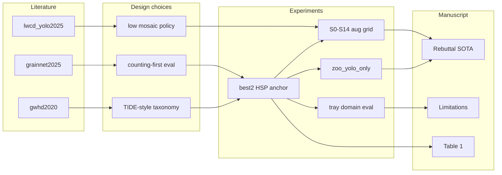

# Study lineage: literature, experiments, and manuscript claims

Maps **why** each experiment block exists, **what** ran in the fork, and **where** it appears in submission markdown. Registry: [`literature_validated.json`](literature_validated.json).

## Layer 1 — Literature to design

| Literature ID | Design choice | Rationale (short) |
|---------------|---------------|-------------------|
| `lwcd_yolo2025` | Low mosaic on benchtop kernels | Dense trays; mosaic-off harms counting in our S2 smoke |
| `grainnet2025` | Counting-first metrics vs mAP alone | Seed counting papers emphasize total error |
| `gwhd2020` | Overlap / duplicate FP awareness | Head-scale counting benchmarks report localization errors |
| `training_tech_scan_2026_*` | Aug and detector scan synthesis | Consolidated 2026 practice for dense small objects |
| `val_test_map_gap` (repo note) | Separate val tuning from test reporting | Avoid peak training-val mAP as generalization |

## Layer 2 — Design to experiment

| Experiment block | Fork entrypoint | Primary artifacts |
|------------------|-----------------|-------------------|
| Anchor `best2` | `experiment.py repro` | `dual_metric.json`, `eval_test_map.json` |
| Aug S0–S14 + 100 ep confirm | `aug_smoke_index.json`, GPU queue | `aug_smoke/leaderboard.json` |
| Zoo P0-5 (`zoo_yolo_only`) | `benchmark_matrix.py` | `matrix_train.json` |
| Tray generalization | `eval_domains.py` | `domains/domain_eval.json` |
| Threshold / operating point | `threshold_sweep.py` | `threshold_val.json`, `threshold_test_locked.json` |
| Error taxonomy | `error_analysis.py` | `tide_bucket_summary.json` |

## Layer 3 — Experiment to manuscript

| Output | Submission location |
|--------|---------------------|
| Test MAE 61.3, mAP50 0.18 | `reports/manuscript/abstract.md`, Table 1 |
| Aug / zoo did not beat anchor | `results_and_methods.md`, rebuttal §3 |
| Single-site / tray spread | `response_to_reviewers.md` §4, `dataset.md` |
| mAP reconciliation | `results_and_methods.md`, `docx_vs_submission.md` |

## Comparative design rationale (Methods paragraph)

We retained upstream production weights and re-measured them under a pre-registered protocol. Augmentation ablations and detector-zoo training ask a single question: does any literature-aligned recipe beat the anchor on the **same** held-out test split at the **same** validation-locked confidence? Tray-level evaluation reports where session variability dominates pooled test error. This structure addresses reviewer requests for SOTA comparison and reproducibility without claiming architectural novelty.

Full literature paste blocks remain in [`related_work_outline.md`](related_work_outline.md) for editors; submission prose stays under `reports/manuscript/`.
