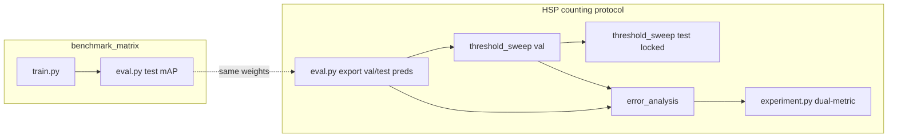

# Eval / threshold / calibration / matrix stack — 2026 tech scan (seed counting)

> **Backlog alignment:** [Model improvement stack](../../backlog.md#model-improvement-stack-test-count-mae) steps **1** (P0-1 **Done**), **3** (**P1-FP-BUDGET**, **MS-FUZZY-BOUND**, **P1-UNCERT-FP**), and **5** (**P0-4**→**P0-5**, **P2-SEED-MAE**). Count-first val selection: `--select min_count_mae` shipped; Methods draft in [p0_summary § Operating point](../../reports/hsp/p0_summary.md#methods-draft--threshold--operating-point).

Research note for **sunflower-Detector** (HSP benchtop seed counting). Compares the implemented **val tune → lock conf → test** protocol against 2025–2026 practice for **counting-first** evaluation (not mAP-only). Companion: [`threshold_calibration_literature.md`](threshold_calibration_literature.md).

**Scope:** `threshold_sweep.py`, `threshold_protocol.py`, `dual_metric_report.py`, `benchmark_matrix.py`, `error_analysis.py`, backlog eval items. **Out of scope:** new scripts; SAHI/Telegram deploy as the primary training metric path (see [`threshold_calibration_literature.md`](threshold_calibration_literature.md) § intro).

**Run env:** all GPU/torch examples use `mamba run -n harchoc python …`; export when GPU OOM @ 1280 uses `HARCHOC_EXPORT_DEVICE=cpu` (see [`backlog.md` § Runbook](../../backlog.md#runbook-gpu), [`p0_summary`](../../reports/hsp/p0_summary.md)).

---

## 1. Current stack (what we have)

### 1.1 HSP protocol (manuscript-facing)

```text
eval.py (val: export-only preds @ low conf) → threshold_sweep (val: tune)
  → threshold_sweep (test: --locked-conf-from) → error_analysis (val + test)
  → experiment.py dual-metric → make_figures
```

Canonical commands: [`EXPERIMENTS.md` § Threshold sweep](../EXPERIMENTS.md#threshold-sweep--error-analysis-real-preds); task status: [`backlog.md` § Work queue](../../backlog.md#work-queue-p0--p2).

| Stage | Script | Role |
|-------|--------|------|
| Detection ranking | `eval.py` | Test-only **mAP50 / mAP50-95** (`model.val`); optional GT/preds JSON export |
| Operating point | `threshold_sweep.py` | Conf grid + optional **IoU grid**; **Platt/isotonic** on val; lock to test |
| Count + taxonomy | `error_analysis.py` | Per-image **MAE / RMSE / rRMSE** + TIDE-style FP buckets |
| Table merge | `experiment.py dual-metric` | `dual_metric_report.v1`: mAP + counting + locked conf |
| Zoo comparison | `benchmark_matrix.py` | Train + chained **test eval**; `--aggregate-seeds` for mAP spread |

**Guardrails** (`harchoc/threshold_protocol.py`): on **test**, `--select`, `--iou-grid`, and `--calibrate` are rejected unless `--locked-conf-from` (or `--allow-test-tuning` for debugging). Split role inferred from paths, `--split-file`, or overlap with `data/splits/*.txt`.

**Locked test block** (`threshold_sweep.py` + `threshold_lock.py`): `locked.row` (TP/FP/FN/F1 at fixed conf) and `locked.counting_metrics` (MAE/rRMSE with bootstrap CI via `stats_ci`).

### 1.2 Selection objective today

- Default: **`--select best_f1`** (tie-break lower conf).
- Alternative: **`--select constraints`** with `--min-recall`, `--min-precision`, `--max-fp-per-image`.
- IoU for matching: single `--iou` or search **`--iou-grid`** / `--iou-min` `--iou-max` `--iou-steps` on val only.
- Calibration: **`--calibrate none|isotonic|platt`** (val only); **`--calibration-metrics`** adds reliability bins + ECE.
- Lock without re-select: **`--locked-conf-from`** or evaluate at fixed **`--fixed-conf`**.

Configs: `configs/experiments/threshold_sweep_val.json`, `threshold_sweep_test_locked.json`, `error_analysis_*.json`.

### 1.3 Error analysis (TIDE-inspired, not full TIDE)

`error_analysis.py` implements dual-IoU FP typing (`--iou` = t_f, `--iou-bg` = t_b), dupe/cls_confusion, bbox area strata, conf×taxonomy grid, ambiguous band. Counting uses the same greedy matcher as the sweep (`detection_match`).

**Not implemented:** official **TIDE delta-AP** per bucket (`tidecv`), or mAP-impact isolation ([Bolya et al., ECCV 2020](https://arxiv.org/abs/2008.08115)).

### 1.4 Matrix / seeds / CV

| Capability | Status | CLI / module |
|------------|--------|----------------|
| Per-model test mAP after train | **Done** | `benchmark_matrix.py --no-dry-run` |
| Multi-seed mAP spread | **Done** (mAP only) | `--aggregate-seeds --train-out …` → `benchmark_matrix_seed_stats.v1` |
| K-fold lists + fold metric CIs | **Done** (manual train per fold) | `cv_eval.py --write-fold-splits`, `--fold-metrics` |
| Count MAE in matrix seed stats | **Next** (P1) | — |
| End-to-end matrix → threshold → dual-metric | **Next** (manual chain) | — |

### 1.5 Ops: high-res export OOM

Documented pattern: export val preds on **CPU** when GPU OOM at imgsz 1280.

```bash
export HARCHOC_EXPORT_DEVICE=cpu
mamba run -n harchoc python scripts/eval.py --split-file data/splits/val.txt --export-only \
  --export-device cpu --export-conf 0.001 --export-iou 0.3 \
  --export-gt-json reports/hsp/gt_val.json --export-preds-json reports/hsp/preds_val.json
```

`benchmark_matrix.py` forwards `HARCHOC_EXPORT_DEVICE` to chained `eval.py` via `--export-device`.

---

## 2. 2025–2026 landscape (counting > mAP)

### 2.1 Counting metrics (agri / dense detection)

Recent counting papers standardize **MAE**, **RMSE**, often **rMAE/rRMSE** (normalized by mean GT count) and **R²** on per-image or per-plot totals — not mAP alone.

| Source | Task | Metrics emphasized |
|--------|------|------------------|
| [SoyCountNet (Frontiers 2026)](https://www.frontiersin.org/journals/plant-science/articles/10.3389/fpls.2026.1743104/full) | Field soybean seeds | MAE, RMSE, R² + **95% CI** across cultivars |
| [MTL-PlotCounter (Remote Sens. 2025)](https://www.mdpi.com/2072-4292/17/15/2688) | UAV soybean seedlings | MAE, RMSE, rMAE, rRMSE, R² at plot scale |
| [Panicle-DETR preprint (2026)](https://www.preprints.org/manuscript/202604.1190) | Rice panicles | MAE, RMSE, R² vs YOLO family |
| [Sunflower UAV YOLOv11 (Sustainability 2026)](https://doi.org/10.3390/su18021026) | Sunflower heads | Grid **conf + NMS IoU**, then F1 / mAP@0.5 |
| [GWHD wheat](https://www.global-wheat.com/gwhd.html) | Wheat heads | mAP@0.5 **and** count RMSE/rRMSE |

**Implication for HSP:** Our **MAE + rRMSE + mae_ci** align with agri norms; adding **R²** (and reporting **signed bias** already in `signed_error_mean_ci`) would match 2026 tables. mAP remains the detector-ranking metric; **locked-count MAE** is the deployment metric.

### 2.2 Threshold selection beyond F1-max

| Method | Idea | Our support |
|--------|------|-------------|
| F1-max on PR sweep | Single global conf | `--select best_f1` (default) |
| Constraint ops point | Min recall, max FP/image | `--select constraints` + flags |
| **oLRP** (Oksuz et al., ECCV 2018) | Min localization-aware error → class-specific conf | **Not implemented** (global conf only) |
| Optimize **count MAE** on val | Direct counting objective | **`--select min_count_mae`** in `threshold_sweep.py` (**P1-FP-BUDGET** Partial: document in MS) |
| Per-class conf | developed vs aborted | **Not implemented** (single operating point) |

Literature closest to benchtop trays: separate **conf** and **NMS/match IoU** sweeps ([sunflower UAV 2026](https://doi.org/10.3390/su18021026)); we support IoU grid on val via `--iou-grid 0.3 0.5 0.7` but NMS at **export** is fixed in `eval.py` (`--export-iou 0.3` per baseline).

### 2.3 Calibration in production

| Topic | 2025–2026 notes | Our support |
|-------|-----------------|-------------|
| Platt / isotonic post-hoc | Still standard; isotonic flexible but overfits small cal sets ([arXiv:2509.23665](https://arxiv.org/html/2509.23665)) | `--calibrate platt\|isotonic` on val preds |
| ECE / reliability | Expected for “trustworthy” scores | `--calibration-metrics` |
| Differentiable isotonic layers | Industrial MT systems ([arXiv:2603.06589](https://arxiv.org/pdf/2603.06589)) | Out of scope (post-hoc only) |
| Monotonicity vs mAP | Monotone remap ≈ preserves AP ranking ([Guo 2017](https://arxiv.org/abs/1706.04599); see internal lit review) | Document in paper; keep uncalibrated mAP in `eval.py` |

**Gap:** No automatic choice between Platt vs isotonic (e.g., hold-out ECE). No integration of calibrated scores into `dual_metric_report.v1`.

### 2.4 TIDE and error analysis

- **TIDE** ([tidecv](https://github.com/dbolya/tide), v1.0.1, stable since 2023) reports **ΔAP contribution** per error type — stronger for “what hurts mAP” than for count MAE.
- 2026 applied papers (e.g. [MA-YOLOv8s comic detection](https://onlinelibrary.wiley.com/doi/10.1155/int/8859427)) use TIDE tables for ablation narrative.
- Our `error_analysis.py` covers **taxonomy + counting** without ΔAP; backlog item: optional `tidecv` cross-check on exported preds.

### 2.5 SAHI / high resolution

- **SAHI** active through 2026 ([obss/sahi](https://github.com/obss/sahi); latest release 0.11.36); Ultralytics documents **YOLO26 + SAHI** sliced inference ([guide](https://docs.ultralytics.com/guides/sahi-tiled-inference)) with batch paths and faster merge backends.
- Repo: `telegram_bot.py`, `experiment.py tune-sahi` / `deploy-parity` — **deploy/tuning**, not wired to `threshold_sweep` / `dual-metric`.
- **Eval protocol gap:** Paper numbers should use **full-frame export** (`eval.py`) unless the manuscript explicitly reports SAHI deploy metrics.

### 2.6 Multi-seed reporting & experiment tracking

| Pattern | Practice | Our support |
|---------|----------|-------------|
| Fixed seeds in train YAML | `seed` in bench configs | `benchmark_matrix` `{model}_e{N}_s{seed}` |
| Aggregate mean ± spread | W&B / MLflow groups by seed | `--aggregate-seeds` (**mAP50 only**) |
| Counting spread across seeds | Common in 2026 agri papers (e.g. SoyCountNet CIs) | **Gap** — need locked sweep per seed |
| Central tracking | MLflow registry + W&B viz ([ZenML comparison 2025](https://www.zenml.io/blog/mlflow-vs-weights-and-biases)) | `collect_run_metadata` in JSON artifacts only |

**Gap:** No W&B/MLflow hooks; provenance is file-based (`reports/hsp/*.json`). Sufficient for reproducible papers if git + manifest SHA256 recorded; weak for interactive sweep comparison. **Mitigation (2026-05-29):** [`configs/experiments/manuscript_repro_bundle.json`](../../configs/experiments/manuscript_repro_bundle.json) + `scripts/experiment.py repro` — canonical configs, artifact paths, split SHA256; see backlog **MS-REPRO**.

### 2.7 Export OOM @ 1280

Industry pattern: **lower device for export**, keep GPU for train; or reduce batch, tile (SAHI), or `max_det`. We implemented env + CLI:

- `HARCHOC_EXPORT_DEVICE=cpu`
- `eval.py --export-device cpu`
- Train/eval `max_det=3000` — **Done**; S14 control at 300 — **Done** ([`s14_maxdet_truncation.json`](../../reports/hsp/s14_maxdet_truncation.json); backlog **P0-1**)

---

## 3. Gap analysis vs HSP protocol

| Gap | Severity | Backlog status | Notes |
|-----|----------|----------------|-------|
| **Real HSP preds** through full chain | P0 | **Next** | Plumbing **Done**; blocked on trained weights + GPU exports |
| **eval `max_det` 300 vs train 3000** on export | P0 | **Done** (P0-1) | `train_bench_base.json` + bench YAML `infer.max_det: 3000`; S14 negative control |
| **dual-metric** counting source | P1 | **Next** | Table uses `error_analysis` counting, not `locked.counting_metrics` — can diverge if `--conf` ≠ locked |
| **Matrix seed stats omit MAE** | P1 | **Next** (P2-SEED-MAE) | `--aggregate-seeds` only compares mAP |
| **Select on count MAE** | P1 | **Partial** (P1-FP-BUDGET) | `--select min_count_mae` in `threshold_sweep.py`; Methods draft in [p0_summary](../../reports/hsp/p0_summary.md#methods-draft--threshold--operating-point) |
| **TIDE ΔAP** | P2 | **Next** | Taxonomy **Done**; impact scores open |
| **oLRP / per-class thresholds** | P2 | **Next** | Two-class deploy (`telegram_bot`) vs single-class train |
| **R² in counting block** | P2 | **Next** | MAE/RMSE/rRMSE present |
| **Calibration in dual-metric** | P2 | **Next** | ECE in sweep JSON only |
| **SAHI ↔ eval protocol** | P2 | **Next** | Separate tuning scripts |
| **CV → dual-metric** | P2 | **Next** | `cv_eval.py` not merged into manuscript table |
| **MLflow/W&B** | P3 | — | Optional; JSON schemas already versioned |
| **Asymmetric seed eval set** | P2 | **Done** ([`asymmetric_seed_policy.v1`](../../configs/eval/asymmetric_seed_policy.json), [EXPERIMENTS § asymmetric](../EXPERIMENTS.md#asymmetric-seed-eval-policy)) | Developed ~55% / aborted ~45%; test-only manuscript metrics |

**Protocol strengths (keep):** val/test guardrails, locked conf, IoU grid on val, bootstrap CIs on MAE, schema-versioned artifacts, DRY merge via `experiment.py dual-metric` — all **Done**.

---

## 4. Recommendations (prioritized, CLI-tied)

Aligned with [`backlog.md` § Work queue](../../backlog.md#work-queue-p0--p2) and [`p0_summary`](../../reports/hsp/p0_summary.md).

### P0 — Run manuscript chain on real exports (**Next**; code **Done**)

1. `mamba run -n harchoc python scripts/split_drift.py --with-ks` before tuning if val≫test.
2. Val export (CPU-safe):

```bash
export HARCHOC_EXPORT_DEVICE=cpu
mamba run -n harchoc python scripts/eval.py --split-file data/splits/val.txt --export-only \
  --export-device cpu --export-conf 0.001 --export-iou 0.3 \
  --export-gt-json reports/hsp/gt_val.json --export-preds-json reports/hsp/preds_val.json
```

3. Val sweep with IoU grid + optional calibration:

```bash
mamba run -n harchoc python scripts/threshold_sweep.py \
  --gt-json reports/hsp/gt_val.json --preds-json reports/hsp/preds_val.json \
  --iou-grid 0.3 0.5 0.7 --steps 60 --tmin 0.01 --tmax 0.6 \
  --calibrate isotonic --calibration-metrics \
  --out reports/hsp/threshold_val.json
```

4. Test lock + dual-metric (from backlog):

```bash
mamba run -n harchoc python scripts/threshold_sweep.py --locked-conf-from reports/hsp/threshold_val.json \
  --gt-json reports/hsp/gt_test.json --preds-json reports/hsp/preds_test.json \
  --out reports/hsp/threshold_test_locked.json

mamba run -n harchoc python scripts/error_analysis.py --locked-conf-from reports/hsp/threshold_val.json \
  --gt-json reports/hsp/gt_val.json --preds-json reports/hsp/preds_val.json \
  --out reports/hsp/error_val.json
mamba run -n harchoc python scripts/error_analysis.py --locked-conf-from reports/hsp/threshold_val.json \
  --gt-json reports/hsp/gt_test.json --preds-json reports/hsp/preds_test.json \
  --out reports/hsp/error_test.json

mamba run -n harchoc python scripts/experiment.py dual-metric \
  --eval-val reports/hsp/eval_val.json --eval-test reports/hsp/eval_test.json \
  --sweep reports/hsp/threshold_val.json --sweep-test reports/hsp/threshold_test_locked.json \
  --error-val reports/hsp/error_val.json --error-test reports/hsp/error_test.json \
  --out reports/hsp/dual_metric.json
```

**P0 (cross-scan):** max_det 3000 + S14 control — **Done** ([`s14_maxdet_truncation.json`](../../reports/hsp/s14_maxdet_truncation.json)); zoo matrix — backlog **P0-5** (blocked on **P0-4**).

### P1 — Counting-first tuning (no new script)

| Action | Status | CLI |
|--------|--------|-----|
| FP budget for dense trays | **Partial** | `--select min_count_mae` (~194–217 FP/img @ locked conf; [p0_summary](../../reports/hsp/p0_summary.md#methods-draft--threshold--operating-point)); or `--select constraints --min-recall 0.90 --max-fp-per-image 0.5` |
| Compare calibrated vs raw scores | **Next** | Two sweeps: `--calibrate none` vs `--calibrate isotonic`; compare `locked.counting_metrics` JSON |
| Ensure error analysis uses locked conf | **Done** (pattern) | `--locked-conf-from reports/hsp/threshold_val.json` on test |
| Document export NMS | **Done** | `--export-iou 0.3` on `eval.py` |
| Multi-seed mAP table | **Next** | `benchmark_matrix.py --no-dry-run` then `mamba run -n harchoc python scripts/benchmark_matrix.py --aggregate-seeds --train-out reports/hsp/matrix_train.json` |
| OOM-safe exports | **Done** | `export HARCHOC_EXPORT_DEVICE=cpu` + `--export-device cpu` |

**Code follow-ups (small, not blocking paper):** extend `dual_metric_report` to prefer `sweep_test.locked.counting_metrics` when present (**Next**); extend `matrix_seed_stats` to ingest per-run error-analysis JSON for MAE spread (**Next**).

### P2 — Research / engineering backlog

| Action | Status | Suggested path |
|--------|--------|----------------|
| TIDE ΔAP cross-check | **Next** | Optional `tidecv` on same GT/preds JSON; compare to `fp_breakdown` |
| oLRP-style threshold | **Next** | Extend `select_operating_point` mode in `threshold_sweep.py` (not a new script) |
| Select min count MAE on val | **Partial** | `--select min_count_mae` shipped; Methods draft Done (**P1-FP-BUDGET**); constraint ablation optional |
| max_det ablation | **Done** (S14) | [`s14_maxdet_truncation.json`](../../reports/hsp/s14_maxdet_truncation.json) |
| SAHI eval branch | **Next** | Document as **deploy metric**; if needed, export preds from `run_infer_once.py` into same JSON schema |
| CV manuscript supplement | **Next** | `cv_eval.py --fold-metrics` per fold after manual `train.py` |
| R² in counting | **Next** | Add to `aggregate_counting_metrics` / `error_analysis` |
| W&B/MLflow | **Next** (optional) | Log existing JSON paths + `run_metadata` as artifacts (integration only) |

### P3 — Do not chase for HSP v1

- End-to-end differentiable isotonic layers (production DL papers).
- Replacing greedy matching with Hungarian / DETR query-count metrics (RT-DETR track is separate).
- SAHI as default training metric path.

---

## 5. Matrix vs eval stack integration



Today the zoo matrix **stops at test mAP**; counting protocol is a **second pass** on exported JSON. That matches literature (detector leaderboard vs operating-point counting) but requires discipline: same `imgsz`, `export-iou`, and weights path in both passes.

---

## 6. Related internal docs

| Doc | Topic |
|-----|-------|
| [`threshold_calibration_literature.md`](threshold_calibration_literature.md) | mAP vs counting, calibration theory, val/test gap |
| [`fp_taxonomy_literature.md`](fp_taxonomy_literature.md) | FP buckets |
| [`backlog.md` § Work queue](../../backlog.md#work-queue-p0--p2) | Task status; HSP preds **Done** on `best2.pt` |
| [`docs/EXPERIMENTS.md`](../EXPERIMENTS.md) | Export + matrix commands; [asymmetric seed policy](../EXPERIMENTS.md#asymmetric-seed-eval-policy) |
| [`docs/training_budget.md`](../training_budget.md) | `HARCHOC_MAX_*`, `HARCHOC_EXPORT_DEVICE` |

---

## 7. References (2025–2026 emphasis)

1. Iamchuen et al. Sunflower UAV detection with YOLOv11. *Sustainability* 2026. [DOI 10.3390/su18021026](https://doi.org/10.3390/su18021026)
2. SoyCountNet. *Frontiers Plant Science* 2026. [10.3389/fpls.2026.1743104](https://www.frontiersin.org/journals/plant-science/articles/10.3389/fpls.2026.1743104/full)
3. MTL-PlotCounter. *Remote Sensing* 2025. [10.3390/rs17152688](https://www.mdpi.com/2072-4292/17/15/2688)
4. Panicle-DETR preprint. 2026. [preprints.org/manuscript/202604.1190](https://www.preprints.org/manuscript/202604.1190)
5. Bolya et al. TIDE. ECCV 2020. [arXiv:2008.08115](https://arxiv.org/abs/2008.08115)
6. Oksuz et al. oLRP. ECCV 2018. [openaccess.thecvf.com](https://openaccess.thecvf.com/content_ECCV_2018/papers/Kemal_Oksuz_Localization_Recall_Precision_ECCV_2018_paper.pdf)
7. Calibration survey. 2025. [arXiv:2509.23665](https://arxiv.org/html/2509.23665)
8. Ultralytics SAHI guide. 2026. [docs.ultralytics.com/guides/sahi-tiled-inference](https://docs.ultralytics.com/guides/sahi-tiled-inference)
9. SAHI repository. [github.com/obss/SAHI](https://github.com/obss/sahi)

---

**Validated 2026-05-29.** CLI flags checked against `scripts/eval.py`, `threshold_sweep.py`, `error_analysis.py`, `experiment.py dual-metric`, `benchmark_matrix.py`, `split_drift.py`. Counting-metric citations spot-checked (SoyCountNet 2026 MAE/RMSE/R²+CI; MTL-PlotCounter 2025 rMAE/rRMSE). Status aligned with [`backlog.md` model improvement stack](../../backlog.md#model-improvement-stack-test-count-mae) steps 1, 3, 5.

**Metric roles:** `dual_metric_report` emits `metric_roles` / per-row `split_role_label` — val = *in-training early-stop split (not generalization)*; test = *held-out manuscript split*. Test ranking mAP: [`eval_test_map.json`](../../reports/hsp/eval_test_map.json) (**SCI-MAP-CPU** / **R-SCI-1** Done). **Val≈0.97 vs test≈0.79 narrative (reviewer):** [`val_test_map_gap.md` §5](../manuscript/val_test_map_gap.md#5-manuscript-draft--val-map-vs-test--results--22) + [`split_drift_p0.json`](../../reports/hsp/split_drift_p0.json); **MS-SPLIT-MAPNARR** Done; **MS-VAL-MAPDOWN** Done — §2.2 paste: [§5 — Paste into §2.2](../manuscript/val_test_map_gap.md#paste-into-22-latex); **test count MAE** primary ([`p0_summary.md`](../../reports/hsp/p0_summary.md)).

**Graded trust / ambiguous band (reviewer §270):** Methods + Discussion repo draft in [`p0_summary.md` § Fuzzy boundary](../../reports/hsp/p0_summary.md#fuzzy-boundary--graded-trust-reviewer-270) and [gap §15](../../docs/manuscript/reviewer_comments_backlog_gap.md#15-manuscript-draft--fuzzy--hierarchical-boundary-seeds-discussion); backlog **MS-FUZZY-BOUND** Done; **`fig_ambiguous_panel`** Done. Not a third detect class — see [`explainability_uncertainty_literature.md`](explainability_uncertainty_literature.md).

**Validated literature registry:** [`docs/manuscript/literature_validated.md`](../manuscript/literature_validated.md) · **Related Work (MS-LIT):** [`related_work_outline.md`](../manuscript/related_work_outline.md)
