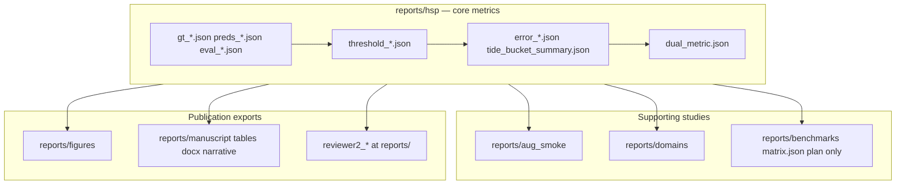

# Reports (generated scientific artifacts)

This tree holds **machine-readable experiment outputs** (JSON/CSV/MD) and figure exports for the sunflower HSP pipeline. Paths here are the **citation source** for manuscript numbers—not ad-hoc files at the repo root.

- **Do not commit** run outputs (gitignored); only `README.md` / `.gitkeep` placeholders are tracked.
- **Regenerate** via [`docs/EXPERIMENTS.md`](../docs/EXPERIMENTS.md) and [`backlog.md`](../backlog.md) runbooks.
- **Branch:** feature work on `pr/backlog-ci-dataset` only (see `.cursor/rules/git-pr-branch.mdc`).

## Scientific layers (read top → bottom)

| Layer | Path | Role |
|-------|------|------|
| **HSP (canonical)** | [`reports/hsp/`](hsp/README.md) | Val tune → lock conf → **test** count MAE, mAP exports, dual-metric, split drift, matrix train aggregate, confusion @ locked conf. **Cite manuscript science here.** |
| **Aug smokes** | [`reports/aug_smoke/`](aug_smoke/README.md) | S0–S14 / 15-ep ablations; leaderboard + comparative analysis (test MAE primary). |
| **Zoo plan (dry-run)** | [`reports/benchmarks/`](benchmarks/README.md) | `matrix.json` plan only; live train/eval aggregates → **`reports/hsp/matrix_train.json`**. |
| **Domain / transfer** | `reports/domains/`, `reports/transfer/` | Tray/domain eval and finetune split lists (not headline test MAE). |
| **Figures** | [`reports/figures/`](figures/README.md) | Journal-style PNG/SVG + `manifest.json` / `run.json`. |
| **Manuscript bundle** | [`reports/manuscript/`](manuscript/README.md) | Preflight manifest, LaTeX-ready tables, docx catalog, backlog narrative. |
| **Reviewer-2 repro** | `reports/reviewer2_*` | CPU audits, paste check, counting/map50 reports — index: [`reviewer2_index.md`](reviewer2_index.md). |
| **Ad-hoc thresholds** | [`reports/thresholds/`](thresholds/README.md) | Default `--out` for exploratory sweeps; HSP sweeps → `reports/hsp/threshold_*.json`. |
| **Ops / queue** | `reports/gpu_queue/` | Local GPU queue state (not manuscript metrics). |
| **Archive** | [`reports/_archive/`](_archive/README.md) | Obsolete paths (800px bench, duplicate probes)—**do not cite**. |

## One-page headline numbers

After a full HSP run (local only, often not in git): [`reports/hsp/p0_summary.md`](hsp/p0_summary.md).

## Regeneration quick ref

| Goal | Command |
|------|---------|
| HSP exports + dual-metric | `experiment.py repro` (see [`manuscript_repro_bundle.json`](../configs/experiments/manuscript_repro_bundle.json)) |
| Publication preflight | `experiment.py manuscript-preflight` → [`manuscript/preflight_manifest.json`](manuscript/preflight_manifest.json) |
| Reviewer-2 chain | `experiment.py reviewer2-repro` |
| Aug leaderboard | `experiment.py aug-leaderboard` / `aug-compare` |
| Split drift (P0) | `split_drift.py --out reports/hsp/split_drift_p0.json` |
| Zoo matrix train | `benchmark_matrix.py --train-out reports/hsp/matrix_train.json` |

## Do not use (stale / non-canonical)

| Path | Use instead |
|------|-------------|
| `reports/eval.json`, `reports/eval/` | `reports/hsp/eval_*.json`, `gt_*.json`, `preds_*.json` |
| `reports/eval_hsp_yolov8n_img800.json` | 1280 HSP protocol under `reports/hsp/` |
| `reports/eval_data.yaml` at **repo root** | `reports/hsp/eval_data.yaml` |
| `reports/split_drift/report.json` | `reports/hsp/split_drift_p0.json` (P0) or `split_drift_rich.json` (`--extended`) |
| `reports/benchmarks/matrix_train.json` for manuscript | `reports/hsp/matrix_train.json` after `--train-out` |
| `reports/_archive/**` | Current `reports/hsp/` artifacts |

Dry-run examples in docs may use generic paths (e.g. `reports/eval.json`); **published numbers** must come from the table above.

## Child READMEs

- [`hsp/README.md`](hsp/README.md) — P0 artifact catalog
- [`manuscript/README.md`](manuscript/README.md) — preflight + tables + docx
- [`aug_smoke/README.md`](aug_smoke/README.md) — augmentation smokes
- [`figures/README.md`](figures/README.md) — figure reproduction
- [`benchmarks/README.md`](benchmarks/README.md) — matrix dry-run vs HSP train-out
- [`thresholds/README.md`](thresholds/README.md) — ad-hoc sweep default dir
- [`error_analysis/README.md`](error_analysis/README.md) — legacy default dir note
