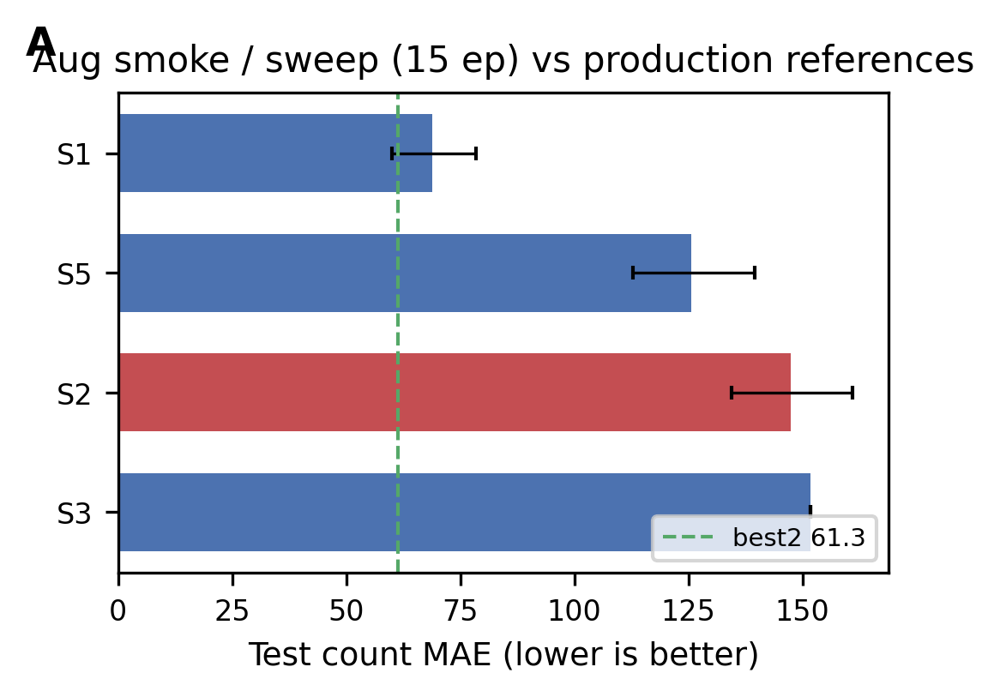

# Aug comparative analysis

*Generated fixture — regenerate via `experiment.py aug-compare`; do not hand-edit for manuscript.*


Generated: `2026-06-01T09:19:07Z` · schema `aug_comparative_analysis.v1`

CPU-only synthesis from [`aug_smoke_index.json`](../../configs/experiments/aug_smoke_index.json) and existing `*_summary.json` artifacts — no re-training.

## Narrative

- Best 15-ep smoke: **S1** (`aug_smoke_close3`) at **68.9** test count MAE — close_mosaic=3 only.
- Equivalence @ 68.9 MAE: S0, S1, S13 (canonical **S1**); do not re-train duplicates.
- Equivalence @ 151.7 MAE: S3, S6, S7 (canonical **S3**); do not re-train duplicates.
- Rejected **S2**: MAE **147.4** — mosaic=0; large MAE regression vs close3 winner
- No 15-ep arm beats production **best2** (61.3 MAE); best smoke is **+7.6** MAE vs best2.

## Rankings (15 ep, deduped)

| rank | smoke_id | MAE | 95% CI | aug knobs |
|------|----------|-----|--------|-----------|
| 1 | S1 | 68.9 | 60.1–78.5 | close_mosaic=3 only |
| 2 | S5 | 125.7 | 112.9–139.6 | mosaic=0.3, close_mosaic=3 |
| 3 | S2 | 147.4 | 134.5–160.9 | mosaic=0, close_mosaic=0 |
| 4 | S3 | 151.7 | — | photometric only; erasing=0.2 |

## Rejected arms

| smoke_id | MAE | vs S1 Δ | reason |
|----------|-----|---------|--------|
| S2 | 147.4 | +78.5 | mosaic=0; large MAE regression vs close3 winner |

## Figures



## Regenerate

```bash
python scripts/experiment.py aug-compare
```

JSON: [`comparative_analysis.json`](comparative_analysis.json) · Leaderboard: [`leaderboard.md`](leaderboard.md).
